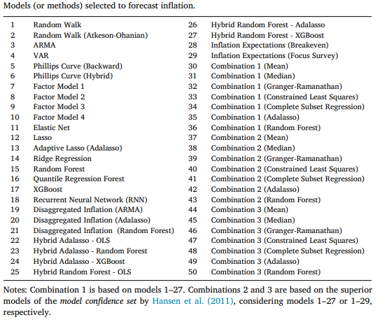

# Literature Review

## [Forecasting Inflation using Machine Learning for an Emerging Economy](https://thesis.eur.nl/pub/60145/Thesis_Sven_Heeren.pdf)

### Abstract

The author aims to build ML model for forecasting inflation for emerging economy country like Mexico, and developed countries like the US.

### Data

The data used for US inflation is from FRED-MD, and for Mexico inflation is from Banco de Mexico.

The US data is monthly from January 1960 to December 2015, and the Mexico data is monthly from January 2001 to January 2021.

The datasets are not stationary, so transformation is done to make them stationary.

### Methodology

#### Benchmark Models

1. Random Walk (RW)
2. Autoregressive Model (AR)
3. Bayesian Vector Autoregression (BVAR)
4. Autoregressive Integrated Moving Average (ARIMA)

#### Machine Learning Models

The author used the models that are been used in paper by Medeiros et al. (2021), BAVART, and LSTM.

### Metrics

These are the metrics used to evaluate the models:

1. Mean Absolute Error (MAE)
2. Mean Squared Error (MSE)
3. Median Absolute Deviation(MAD)

averaged over 1 to 12 months ahead forecast.

### Results

#### United States Data Analysis

The BVAR model outperforms mainly all the other models in all metrics.

#### Mexican Data Analysis

when the model evaluated RMSE, MAE, the Random Forest (RF) model outperforms the other, While  the MAD metric, there's BEST model outperforms the other models in all different horizons.

### Conclusion

Deep Learning approach like LSTM perfrormed worse in most of the cases compared to the other models.

Giving the reason that the number of epochs is only 200 which is not sufficient, and the number of layers is only low.

## [Machine learning methods for inflation forecasting in Brazil: New contenders versus classical models](https://www.sciencedirect.com/science/article/pii/S2666143823000042?via%3Dihub)

### Abstract

exploration of machine learning (ML) methods to improve inflation forecasting in Brazil.

Using an extensive out-of-sample forecasting exercise is designed with multiple horizons, a large database of 501 series, and 50 forecasting methods, including new ML techniques proposed in the paper, traditional models and forecast combination methods.

### Data

The  target variable is IPCA, which is the consumer price index (CPI) measured by the Brazilian Institute of Geography
and Statistics (IBGE).

The database covers 501 time series, coming from 167 macroeconomic and financial variables used to build high-dimensional models.

Which are provided by Anbima, BCB, EPU.

### Methodology

The Author used 50 models, half of them are combination models.

### Results

At the shortest horizon ($h = 1$), the best models are the combination model comb3GR.

For Longer horizons, the accuracy of the models decreases, and it worth highlighting the good performance of the regression tree-based methods (RF, QRF60 and XGBoost)

For longer horizons ($h \geq 12$). The recurrent neural network (RNN) also shows a good result at longer horizon.
